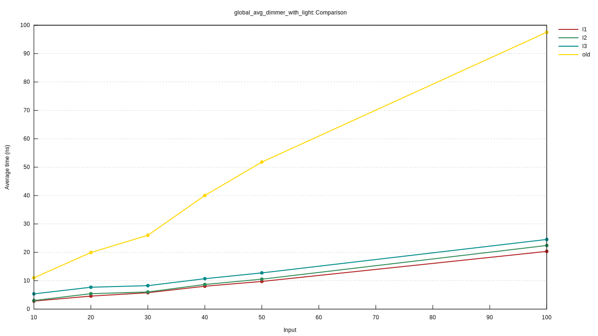
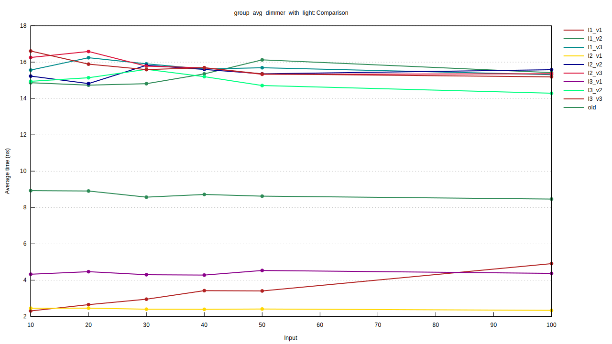
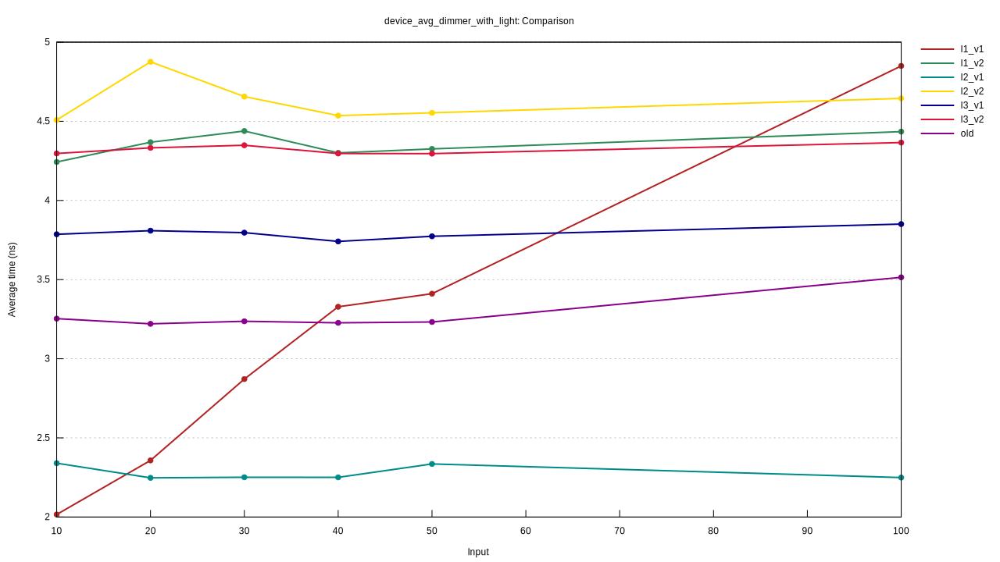

# igloo device tree / query testing grounds

Testing some different methods for storing the device tree in column-wise
storage for extremely efficient queries.
Also, fully concurrent, lock-free storage by leveraging atomics.

It compares the various methods against a best-effort recreation of the
old query + device tree system.

The new methods are pretty standard for ECS engines.

Note: Code is partially AI written.

## Columns
The goal here is to really quickly evaluate
"find the avg brightness of lights."
This effectively means "find the average value of Dimmer components that are on entities with a Light ZST component."

Commonly, these are scoped to either a device or group of devices.

The idea is having a 2d array of bits (an array of bitsets) that represent if an entity has a given component.
This gives us a superpower, we can simply do `presense[Dimmer] & presense[Light]` or `presense[Dimmer] & .. & group_scope[id of kitchen]`.

What we get back is a bitset which correlates to slot indexes (in this case slots are entities stored globally) which matched our query. We can iterate this and grab all our values via `values[Dimmer][slot ID]`.

It's branch-less, cache-friendly (dense), no pointer chasing, and, once we have the result, fast to iterate over.

## Concurrency
 - Most components are <=8 bytes
 - We'll only target 64-bit systems

Given this, it makes sense to store most components
as `AtomicU64` with relaxed loading and storing.

But we still have problem: if just used `Vec<_>` we would
break concurrency, because every push can cause a `realloc`
which moves the entire `Vec`.

Here we are simply over-allocating massive slices.
Obviously not a great method, I haven't chosen if I want
to go with a paged/concurrent append-only `Vec` implementation
or simply just eat the cost of slices + use `MaybeUninit<_>` (and rely on OS for lazy page allocation).

## Layer Bitsets
This is an idea from [hibitset](https://github.com/amethyst/hibitset)
where you have a hierarchical bitset such that
each layer "summarizes" the layers below it,
allowing for fast iteration on sparse data.

This tests 1 layer (no hierarchy), 2 layers, and 3 layers.

## Versions
V1: devices and groups are bitsets (as shown above)

V2: devices and groups are slot ID ranges

V3: devices are slot ID ranges, groups have to read these

## Max Throughput Results

1 billion QPS!!

Obviously completely impractical/useless for a smart home.

```
Igloo L2 V1 Throughput Benchmark
18 OS threads, 1s warmup, 3s per run
====================================================================================================

--- 30 devices ---

global avg Dimmer w/ Light                    |  30 devices |   1650715490 queries/sec |   4952522752 total in 3.00s
global avg Real w/ Sensor                     |  30 devices |    321315819 queries/sec |    964047872 total in 3.00s
group avg Dimmer w/ Light                     |  30 devices |   3453351544 queries/sec |  10360751104 total in 3.00s
group avg Real w/ Sensor                      |  30 devices |   1480131103 queries/sec |   4440675328 total in 3.00s
device avg Dimmer w/ Light                    |  30 devices |   3874422070 queries/sec |  11624002560 total in 3.00s
device avg Real w/ Sensor                     |  30 devices |   3264837667 queries/sec |   9795159040 total in 3.00s

--- 100 devices ---

global avg Dimmer w/ Light                    | 100 devices |    556276816 queries/sec |   1669009408 total in 3.00s
global avg Real w/ Sensor                     | 100 devices |     90409238 queries/sec |    271251456 total in 3.00s
group avg Dimmer w/ Light                     | 100 devices |   3268260016 queries/sec |   9805548544 total in 3.00s
group avg Real w/ Sensor                      | 100 devices |   1410568635 queries/sec |   4232074240 total in 3.00s
device avg Dimmer w/ Light                    | 100 devices |   3510997432 queries/sec |  10536034304 total in 3.00s
device avg Real w/ Sensor                     | 100 devices |   3032602720 queries/sec |   9102632960 total in 3.00s

```

## Comparison Results
This compares the query mentioned above against all methods,
on various sized smart homes (10-100 devices).

One test evaluates global, one for a group of devices, and one for only 1 device.

This test pretty cleanly cements L2 V1 as the all around champion (hence why it's used above).

## Global
Pretty much expected results.
There are many matches so not having to go through the hierachical bitset layers gives a slight performance edge.

Pretty awesome to see it absolutely crushing the old system.



## Group
This is quite a wild result.
 - L3 is hurting us here. 100 devices is very few so the less indirection from L2 wins.
 - V3 is expectedly very slow (pointer chasing & generally not cache friendly)
 - V2 is interesting... I would have guessed that iterating over a smaller subset is better, but clearly less indirection and better cache behavior is much more important.



## Device
This is quite an interesting result. You'd think, we are only targeting one device, why would evaluation time grow with device input size (for the old system)? 
My best guess here is that the `Vec`'s massive allocation causes cache line pollution or TLB misses (since entities and devices are both huge).


